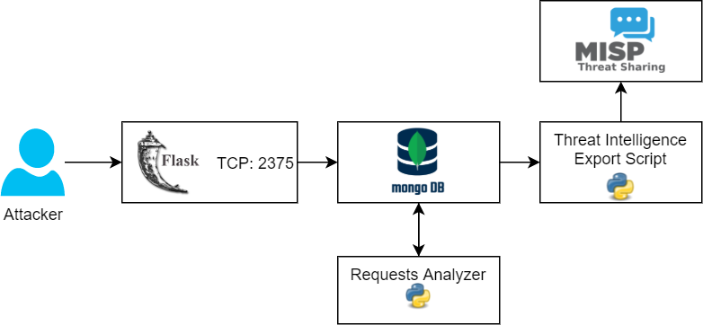
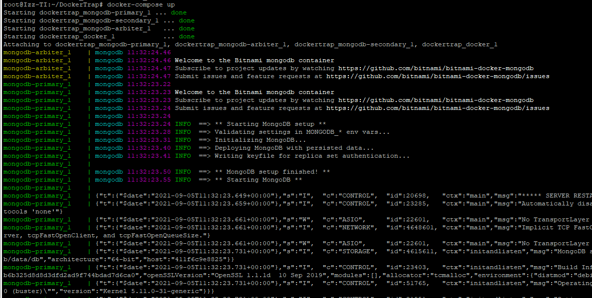

# DockerTrap

The basic schema:


There are 3 main scripts:
- app.py - The main request handler. Responsible for requests logging and working with internal fake images or containers.
- analyzer.py - Implements request analyzing logic based on data from the database, shows information about attacks.
- actions.py - Can be used to export Threat Intelligence data to\from MISP or local CSV files.

## Implemented commands
Currently, the following docker commands are supported:
- info
- version
- images (image ls)
- image pull
- image build
- containers (container ls)
- container inspect
- container run
- container exec
- container cp
- container rm

## Installation and running
The source code can be found on Gitlab (https://github.com/i223t/DockerTrap). The tool can be used as a standalone Flask app or as a docker container using docker-compose instructions.

There are 2 docker compose files:
- ***docker-compose*** - contains an internal mongodb instance.
- ***docker-compose-external-db.yml*** - a configuration for an external mongodb instance

Both installations can be launched using the commands:
```sh
docker-compose up
#or
docker-compose -f docker-compose-external-db.yml up
```


## Tools
Since all the tools are running inside docker it's necessary to get the running docker container`s name:
```sh
docker ps
```

analyzer.py can be launched using the command (it might be nesessary to change the container`s name)
```sh
docker exec -it dockertrap_docker_1 python3 /app/src/analyzer.py
```

actions.py can be used to export data or communicate with the MISP instance:
```sh
#to export events for the last 60 minutes as a csv file
docker exec -it dockertrap_docker_1 python3 actions.py export_csv -f /tmp/events.csv -l 60

#to get events for the last 60 minutes and create a new event in MISP (event will be updated if it's already exist)
docker exec -it dockertrap_docker_1 python3 actions.py export_misp -l 60 -e DockerTrap

#to export a published MISP event as a MISP feed
docker exec -it dockertrap_docker_1 python3 actions.py generate_misp_feed -e DockerTrap -d ./export/misp
```

## Example
